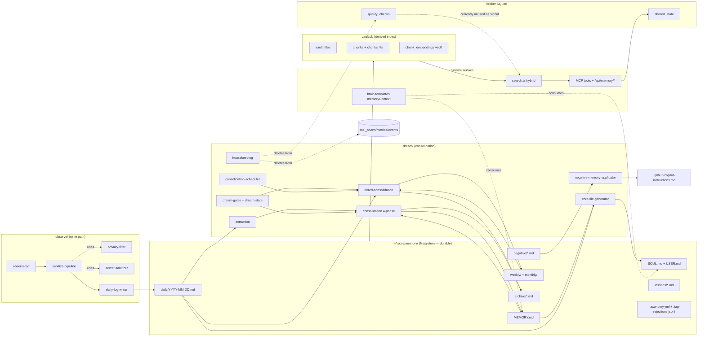

# 01 — SCNS Memory Current-State Audit

**Status:** snapshot as of 2026-04-23 against `/Users/johnhain/Coding_Projects/scns` (read-only).
**Purpose:** inventory every memory-shaped surface in SCNS so Lethe's extraction plan (WS7) can proceed without guesswork. Paired with `01b-dream-daemon-design-note.md`, which evaluates the dream-daemon pattern on its own merits.

All file paths are relative to the SCNS repo root.

---

## 0. Classification tags

Every row below carries one or more of these tags:

- **`short-term-trackpad`** — scratch surface observations land on first (daily logs).
- **`long-term-store`** — durable storage of memories that have survived consolidation.
- **`scoring-retrieval`** — ranks, scores, or fetches memories.
- **`consolidation-dream`** — offline merge / promote / demote / archive.
- **`suggestion-surface`** — produces user-facing recommendations derived from memory.
- **`infrastructure`** — locks, barrels, chunkers — not a memory policy decision.
- **`candidate-for-lethe`** — strong candidate to move into the Lethe runtime layer.

## 1. `src/memory/` — 18 modules

| File | Purpose | Key exports | Storage touched | Callers | Tags |
|---|---|---|---|---|---|
| `src/memory/db.ts` | Opens `vault.db` SQLite with sqlite-vec + FTS5; defines schema. | `openMemoryDb`, `closeMemoryDb`, `EMBEDDING_DIMENSIONS` (=384) | SQLite tables: `vault_files`, `chunks`, `chunks_fts` (FTS5 virtual), `chunk_embeddings` (vec0 float[384]) | `src/cli.ts:315`, `src/memory/index.ts` | long-term-store, candidate-for-lethe |
| `src/memory/vault.ts` | Filesystem-backed markdown vault with atomic writes + daily log appender. | `createVault`, `Vault` type, `VaultFile`, `CoreFileName` (`'SOUL.md'\|'USER.md'\|'MEMORY.md'`) | FS under `<rootDir>` (normally `~/.scns/memory/`): `SOUL.md`, `USER.md`, `MEMORY.md`, `daily/*.md`, `negative/*.md`, `weekly/*.md`, `monthly/*.md`; excludes `archive/` from listings | `cli.ts:79,857,1417`, `dream/dream-daemon.ts:23`, `observe/observation-manager.ts:12,103`, `otel/learning-pipeline.ts`, `otel/session-digest.ts`, `memory/core-file-generator.ts` | short-term-trackpad, long-term-store, candidate-for-lethe |
| `src/memory/chunker.ts` | Pure paragraph-aware chunker (~400-token chunks, 50-token overlap). | `chunkText`, `estimateTokens`, `Chunk`, `ChunkConfig` | none (pure) | `memory/indexer.ts` | infrastructure, candidate-for-lethe |
| `src/memory/embeddings.ts` | FastEmbed ONNX singleton (BGE-small-en-v1.5, 384-dim) with explicit session release. | `generateEmbedding`, `generateEmbeddingsBatch`, `serializeEmbedding`, `deserializeEmbedding`, `resetEmbeddingClient`, `getEmbeddingStatus` | In-process ONNX session; BLOBs in `chunk_embeddings` | `memory/indexer.ts`, `memory/search.ts`, `memory/backfill-runner.ts`, `broker/server.ts:22` (health) | scoring-retrieval, candidate-for-lethe |
| `src/memory/indexer.ts` | Incremental vault→DB indexer (mtime + SHA-256 gating, transactional upserts). | `indexVault`, `indexVaultSync`, `backfillEmbeddings`, `IndexStats` | Writes `vault_files`, `chunks`, `chunk_embeddings`, `chunks_fts` (via triggers) | `cli.ts:291,326,435,537,576,594,620,667,671,865` | long-term-store, candidate-for-lethe |
| `src/memory/indexing-lock.ts` | Process-wide promise queue serializing index + backfill to avoid concurrent ONNX batches. | `withIndexingLock` | In-memory singleton | `memory/backfill-runner.ts` | infrastructure |
| `src/memory/backfill-runner.ts` | Progressive non-blocking embedding backfill in clamped batches (default 32, max 256). | `createBackfillRunner`, `BackfillRunner`, `BackfillStatus`, `BackfillState` | `chunks`, `chunk_embeddings` | No direct importer in `src/` grep — likely wired in `broker/startup.ts`; follow-up flagged | long-term-store, candidate-for-lethe |
| `src/memory/search.ts` | Hybrid vector+FTS5 search; default weights `0.7 vec / 0.3 kw`; L2→similarity, BM25→`1/(1+abs(rank))`. | `hybridSearch`, `keywordSearch`, `keywordOnlySearch`, `escapeFts5Query`, `SearchConfig`, `SearchResult` | Reads `chunk_embeddings`, `chunks_fts`, `chunks` | `cli.ts:290,523`; `broker/routes/dashboard-routes.ts:670` (`/api/memory/search`) via `deps.memorySearch` | scoring-retrieval, candidate-for-lethe |
| `src/memory/archive-store.ts` | FS-backed "drunk memories" — YAML-frontmatter `.md` files **not** indexed into search. | `createArchiveStore` (`archive`, `list`, `search`, `count`), `ArchivedEntry` | FS `<vault>/archive/*.md`. `archiveReason` ∈ {`superseded`, `low-value`, `old`, `duplicate`, `pruned`, `user-rejected`, `deprioritized`} | `dream/dream-daemon.ts:24`, `dream/tiered-consolidation.ts:11` | consolidation-dream |
| `src/memory/core-file-generator.ts` | Rebuilds `SOUL.md` (templated) and `USER.md` (synthesized from `MEMORY.md` + daily logs). | `generateCoreFiles`, `CoreFileGeneratorOptions`, `GenerationResult` | FS: writes `SOUL.md`, `USER.md`; reads `MEMORY.md` + `daily/`. Depends on `dream/memory-entries.parseMemoryMd` (memory → dream dependency). | `dream/dream-daemon.ts:25,234` | suggestion-surface, consolidation-dream |
| `src/memory/lessons.ts` | Scoped lesson store (global / project / agent) w/ YAML frontmatter; legacy-migration helper. | `createLessonStore`, `parseLesson`, `serializeLesson`, `LessonFrontmatterSchema`, `lessonMatches`, `detectRepoSlug`, `migrateLegacyLessons`, `DEFAULT_MIGRATION_RULES` | FS `<vault>/lessons/*.md`; legacy moved to `<memoryRoot>/.legacy-lessons/` | `suggest/executor.ts:13`, `suggest/extractors/tag-suggestion-extractor.ts:15` | suggestion-surface |
| `src/memory/negative-memory-types.ts` | Type definitions for "don't do this" memories. | `NegativeMemory`, `NegativeMemoryInput`, `HeuristicNegativeMemoryInput` | none (types) | store + applicator | long-term-store |
| `src/memory/negative-memory-store.ts` | Vault-backed store for negative memories (auto-picked up by indexer). | `createNegativeMemoryStore`, `NegativeMemoryStore` (`storeFromTool`, `storeFromHeuristic`, `list`, `search`, `getById`, `count`) | FS `<vault>/negative/<uuid>.md` | `cli.ts:42,81`, `memory/negative-memory-applicator.ts:16,100`, `broker/services/quality-gate-arbiter.ts:32` | long-term-store |
| `src/memory/negative-memory-applicator.ts` | Deterministically rebuilds a managed fenced block in `.github/copilot-instructions.md` from rules `≥ minConfidence` (default `0.7`); idempotent. | `applyNegativeMemories`, `buildManagedBlock`, `extractManagedBlock`, `ApplyConfig`, `ApplyResult`, `BLOCK_START`, `BLOCK_END` | Reads negative vault files; writes `<projectRoot>/.github/copilot-instructions.md`; flips `targetApplied`+`appliedTo` on vault files | `dream/dream-daemon.ts:22,161` | suggestion-surface, consolidation-dream |
| `src/memory/sentiment-analyzer.ts` | Heuristic regex-weighted negative-sentiment detector (`FRUSTRATION` / `CORRECTION` / `PROHIBITION` / `QUALITY` / `BEHAVIOR`). | `analyzeSentiment`, `SentimentSignalType`, `RecommendedTarget`, `SentimentAnalysis` | pure | `cli.ts:43,169` | scoring-retrieval |
| `src/memory/tag-rejections.ts` | JSONL log of human-rejected tag proposals, keyed by normalized signature. | `createTagRejectionStore`, `rejectionSignature`, `TagRejectionStore` | FS `<vault>/.tag-rejections.jsonl` | `cli.ts:220`, `suggest/extractors/tag-suggestion-extractor.ts:16` | suggestion-surface |
| `src/memory/taxonomy.ts` | YAML taxonomy of promoted tags (scope + project/agent). | `createTaxonomyStore`, `parseTaxonomy`, `serializeTaxonomy`, `TaxonomyStore` | FS `<vault>/.taxonomy.yml` | `cli.ts:217`, `suggest/executor.ts:14` | suggestion-surface |
| `src/memory/index.ts` | Barrel re-exporting `db`, `vault`, `chunker`, `embeddings`, `indexer`, `search`. | (re-exports) | — | library consumers | infrastructure |

### Notable coupling signals

- **Memory depends on Dream.** `core-file-generator.ts:9` imports `dream/memory-entries.js` (`parseMemoryMd`). The reverse direction (dream → memory) is expected; this back-dependency means any extraction into Lethe must move both subsystems together or introduce a shared schema module.
- **Two distinct storage models under one subsystem.** (a) SQL indexing layer (`db` + `indexer` + `embeddings` + `search`) backed by `vault.db`. (b) Pure filesystem markdown (`vault`, `archive-store`, `negative-memory-store`, `lessons`, `taxonomy`, `tag-rejections`). `vault.ts` is the filesystem authority; `vault.db` is a derived read-side index. This separation is already a proto-"runtime over substrate" split.

---

## 2. `src/observe/` — memory write path

Only modules that ultimately write to the vault or the embedding store are covered. Observe's broader responsibility (process signals, plugins, pattern detection) is out of scope.

- **`src/observe/observation-manager.ts`** — single construction site for `vault = createVault({rootDir: vaultRootDir})` plus a `countingWriter` that calls `vault.appendDailyLog(entry, date)` (lines 102-112). Wraps the writer in `createDailyLogWriter(countingWriter, bufferObservation)` and injects `logWriter` into every observer factory: `active-app`, `file-changes`, `git-activity`, `terminal-history`, `browser-tabs`, `session-hooks`, `config-changes` (lines 117-182). Constructs `privacyFilter = createPrivacyFilter(...)` and `secretSanitizer = createSecretSanitizer()` and passes them into observers that need them (terminal-history gets `sanitizer`; others get `privacyFilter`).
- **`src/observe/sanitize-pipeline.ts`** — `createSanitizePipeline(filter, sanitizer)`: returns `null` if `filter.shouldFilter(context)` else `sanitizer.sanitize(content)`. Pure; writes nothing.
- **`src/observe/privacy-filter.ts`** — `createPrivacyFilter`, `matchGlob`, `FilterContext { type, appName?, filePath?, url? }`. Rules come from `PrivacyConfig` in `observe/types.ts`.
- **`src/observe/secret-sanitizer.ts`** — detects `api-key`, `bearer-token`, `aws-key`, `github-token`, `slack-token`, `ssh-key`, `password-assignment`, `generic-secret`, `env-var-secret`, `jwt`, `custom`; redacts in-place.
- **`src/observe/daily-log-writer.ts`** — `formatObservation(obs) → "**[<type>]** <content>\nTags: ..."`; `createDailyLogWriter(writer, onObservation?)` calls `writer.appendDailyLog(formatted, date)`. Artifact = markdown line appended under a `## HH:MM:SS` heading inserted by `vault.appendDailyLog`.
- **`src/observe/observer.ts`** — only the `Observer` / `ObserverState` interface; no I/O.
- **`src/observe/observers/*`** that write via `logWriter`: `active-app.ts`, `browser-tabs.ts`, `file-changes.ts`, `git-activity.ts`, `session-hooks.ts`, `terminal-history.ts` (also takes `secretSanitizer`). `session-hooks.ts` additionally emits `Observation` objects consumed by the broker hook endpoint (`cli.ts:105`).
- **`src/observe/tags.ts`** — `buildTags()` constructs the `Tags: source=…, session-id=…` trailer. The trailer is later consumed by `dream/extraction.ts`'s noise filter, which drops entries tagged `pre-tool-use`, `post-tool-use`, `tool-use`, `session-start`, `session-end`.

**Key artifact produced by the observe path:** markdown lines appended to `<vault>/daily/YYYY-MM-DD.md`. That file is the primary short-term trackpad that feeds `dream/extraction.ts` → `dream/consolidation.ts` → `MEMORY.md`.

Classification: **short-term-trackpad, candidate-for-lethe** (for sanitize-pipeline, privacy-filter, secret-sanitizer — these are general-purpose and Lethe will need equivalents). `observation-manager` and the observers themselves stay in SCNS; they are the host-integration layer.

---

## 3. Broker tables with memory-shaped data

### 3.1 `shared_state` — `src/broker/storage/schema.sql:57-64`

| Column | Type |
|---|---|
| `key` | `TEXT PRIMARY KEY` |
| `value` | `TEXT NOT NULL` |
| `story_id` | `TEXT` |
| `session_id` | `TEXT REFERENCES sessions(id)` |
| `updated_at` | `DATETIME DEFAULT (datetime('now'))` |

Index: `idx_state_story ON shared_state(story_id)`.

- **Writers:** `broker/storage/repositories/state-repository.ts` (INSERT at line 15; DELETEs at 39, 57, 62, 67); `broker/services/session-recovery.ts:49,85` (`recovery_hard_disabled` flag); `cli.ts:644` (thermal / hot-start flag); plus session-id sweeps in `broker/services/session-gc.ts:47`, `session-recovery.ts:388`, `storage/repositories/history-repository.ts:246`.
- **Readers:** `state-repository.ts:31,51`; `session-recovery.ts:45,70`; `cli.ts:641`.

Classification: **short-term-trackpad** — used as a coordination KV, not a memory store. Not a candidate for Lethe; Lethe's equivalent is scoped session state which belongs in the host (SCNS) runtime.

### 3.2 `memory_entries` — **does not exist as a SQL table**

`grep -r memory_entries src/` yields no matches. The name `memory-entries` refers to `src/dream/memory-entries.ts`, which parses the `MEMORY.md` markdown file. **`MEMORY.md` is the memory-entries "table" in SCNS today — it lives on the filesystem, not in SQL.** This is itself a design observation relevant to WS3 Track A (composition): SCNS already bifurcates durable structured memory (markdown) from derived indexes (SQL).

### 3.3 `quality_checks` — `src/broker/storage/schema.sql:330-340`

| Column | Type |
|---|---|
| `id` | `TEXT PRIMARY KEY` |
| `session_id` | `TEXT` |
| `task_type` | `TEXT NOT NULL DEFAULT 'implementation'` |
| `output` | `TEXT NOT NULL` |
| `passed` | `INTEGER NOT NULL DEFAULT 0` |
| `score` | `REAL NOT NULL DEFAULT 0` |
| `findings` | `TEXT NOT NULL DEFAULT '[]'` |
| `created_at` | `DATETIME DEFAULT (datetime('now'))` |

Index: `idx_quality_checks_session ON quality_checks(session_id, created_at)`.

- **Writers:** `broker/storage/repositories/quality-repository.ts:27`; `broker/services/quality-gate-arbiter.ts` (persists every verdict).
- **Readers:** `quality-repository.ts:46, 61, 199, 214`.

Classification: **suggestion-surface, candidate-for-lethe-utility-signal.** Quality-gate verdicts are exactly the kind of *utility feedback* PDF §gap 1 calls "hardest to capture but critical." They are currently logged but not folded back into retrieval scoring. Lethe's scoring function (WS5) should treat this table (or a Lethe-owned equivalent) as a first-class utility signal.

---

## 4. Filesystem layout under `~/.scns/`

Derived from `cli.ts`, `memory/*`, `suggest/executor.ts`, `otel/auto-config.ts`, `secrets/internal-token.ts`, `observe/plugins/chronicle-reader.ts`, `cli/service-generators.ts`.

```
~/.scns/
├── memory/                         ← vaultRootDir (cli.ts:76)
│   ├── SOUL.md                     (core-file-generator)
│   ├── USER.md                     (core-file-generator)
│   ├── MEMORY.md                   (dream-daemon)
│   ├── vault.db  [+ -wal, -shm]    (cli.ts:295 openMemoryDb)
│   ├── daily/YYYY-MM-DD.md         (vault.appendDailyLog)
│   ├── weekly/YYYY-WNN.md          (tiered-consolidation)
│   ├── monthly/YYYY-MM.md          (tiered-consolidation)
│   ├── negative/<uuid>.md          (negative-memory-store)
│   ├── archive/*.md                (archive-store — excluded from indexer)
│   ├── lessons/*.md                (lessons.ts; suggest/executor default)
│   ├── .taxonomy.yml               (taxonomy.ts; cli.ts:217)
│   ├── .tag-rejections.jsonl       (tag-rejections.ts; cli.ts:220)
│   └── .legacy-lessons/            (lessons.migrateLegacyLessons)
├── dream.db  [+ -wal, -shm]        (cli.ts:367 — dream_state + consolidation_schedule)
├── state/
│   ├── autonomy.json               (shared/autonomy.ts, cli.ts:1792,1801)
│   └── …                           (other autonomy persistence)
├── logs/                           (cli.ts:2587)
├── secrets/                        (cli.ts:1815)
├── skills/                         (suggest/executor.ts:608 default)
├── automations/                    (suggest/executor.ts:609 default)
├── browser-runs/<runId>/           (suggest/executor.ts default)
├── workflows/<slug>.md             (suggest/artifact-generators.ts:210)
├── config/
│   ├── skills.json                 (suggest/executor.ts:143)
│   └── agents.json                 (suggest/executor.ts:221)
├── telemetry/copilot-otel.jsonl    (otel/auto-config.ts)
├── chronicle-cursor.json           (observe/plugins/chronicle-reader.ts:73)
├── .internal-token                 (secrets/internal-token.ts — mode 0600)
└── recovery_hard_disabled          (broker/services/session-recovery.ts — flag file)
```

The broker DB's path did not surface under `.scns` grep; it's configured in `broker/startup.ts` / `broker/config.ts`. Out of scope for the memory audit but flagged for WS7 migration.

---

## 5. External callers

### 5.1 MCP-shaped tools (`scns_memory_search`, `scns_memory_store`, `scns_suggestions`)

Declared and dispatched in `src/copilot-extension/tool-definitions.ts`:

- `scns_memory_search` — schema at `:29`, handler at `:316`, calls `GET /api/memory/search?q=&top_k=` (`:320`).
- `scns_memory_store` — schema at `:41`, handler at `:324`, calls `POST /api/memory/store` with `{key, value}` (`:326`).
- `scns_suggestions` — schema at `:53`, handler at `:337`, calls `GET /api/suggestions?status=` (`:340`).

The same schema is duplicated as a string template in `src/copilot-extension/extension-template.ts:264, 282, 301`.

Broker-side route handlers live in `src/broker/routes/dashboard-routes.ts`:

| Route | Line | Delegates to |
|---|---|---|
| `GET  /api/memory/search` | 670 | `deps.memorySearch.search(q, topK)` |
| `GET  /api/memory/stats`  | 685 | `deps.memoryStats.getStats()` |
| `GET  /api/memory/files`  | 697 | `deps.memoryFiles.listFiles()` |
| `POST /api/memory/store`  | 718 | `deps.memoryStore.store(key, value)` |
| `GET/POST /api/negative-memory/*` | 740, 761, 779, 803 | negative-memory-store |
| `GET /api/lessons` / scoped | 823, 837 | lesson store |
| `POST /api/archive`, `GET /api/archive` | 860, 899 | archive-store |
| `GET /api/tiers` | 912 | tiered-consolidation read |

The `deps.*` injection site is `src/cli.ts:518-545`:

```ts
memorySearch: memoryDb ? { search: async (query, topK) => {
  if (embeddingsReady) { try { return await hybridSearch(memoryDb!, query, { limit: topK }) } catch {} }
  return keywordOnlySearch(memoryDb!, query, topK)
} } : undefined,
memoryStore: memoryDb ? { store: async (key, value) => {
  vault.write(key, value); indexVaultSync(memoryDb!, vault); return { stored: true, key }
} } : { store: async (key, value) => { vault.write(key, value); return { stored: true, key } } }
```

This wiring is the current *runtime layer* — exactly the surface Lethe will own.

### 5.2 Imports from `../memory` / `../dream`

- `suggest/executor.ts:13-14` → `memory/lessons.js`, `memory/taxonomy.js`
- `suggest/extractors/tag-suggestion-extractor.ts:15-16` → `memory/lessons.js`, `memory/tag-rejections.js`
- `broker/restart-manager.ts:11` → `dream/housekeeping.js`
- `broker/server.ts:22` → `memory/embeddings.js` (`getEmbeddingStatus` for health)
- `broker/services/quality-gate-arbiter.ts:32` → `memory/negative-memory-store.js`
- `memory/core-file-generator.ts:9` → `dream/memory-entries.js` *(memory → dream back-dependency)*
- `otel/learning-pipeline.ts:9` → `memory/vault.js`
- `otel/session-digest.ts:8-9` → `dream/memory-entries.js`, `memory/vault.js`
- `otel/pattern-extractor.ts:8` → `dream/memory-entries.js`
- `observe/observation-manager.ts:12` → `memory/vault.js`
- `dream/tiered-consolidation.ts:10-11` → `memory/vault.js`, `memory/archive-store.js`
- `dream/dream-daemon.ts:22-25` → `memory/negative-memory-applicator.js`, `memory/vault.js`, `memory/archive-store.js`, `memory/core-file-generator.ts`

### 5.3 Brain / agent-loop

- `src/brain/templates.ts` renders `{{memoryContext}}` in four Handlebars templates (lines 21-23, 55-57, 108-110, 134-136, 164-166) and `{{soulContext}}` in one (line 181). Declared as `optionalVars: ['memoryContext', …]` / `['memoryContext', 'soulContext']`.
- `src/brain/template-types.ts:22-24` — `TemplateVars.memoryContext?: string`, `soulContext?: string`.
- **No direct imports of `../memory` / `../dream` from `src/brain/`.** The `memoryContext` string is injected by the template caller — not pinned by grep but almost certainly `agent-loop` / `agent-spawner`. Follow-up for WS7 to confirm.

### 5.4 Team-member prompts

`team_members.role` in `broker/storage/schema.sql:105-110` includes `scns-brain`. No prompt template grep-hits reference memory directly — team-member memory injection is currently done via `memoryContext` through the brain template pipe.

---

## 6. Master classification table

Every memory-shaped piece, tagged once per the ruleset at §0:

| Piece | Tag |
|---|---|
| `vault.ts` (markdown FS) | short-term-trackpad + long-term-store, candidate-for-lethe |
| `vault.db` (sqlite index) | long-term-store, candidate-for-lethe |
| `indexer.ts` | long-term-store, candidate-for-lethe |
| `embeddings.ts` | scoring-retrieval, candidate-for-lethe |
| `search.ts` (hybrid) | scoring-retrieval, candidate-for-lethe |
| `chunker.ts` | infrastructure, candidate-for-lethe |
| `backfill-runner.ts` | long-term-store, candidate-for-lethe |
| `archive-store.ts` | consolidation-dream, candidate-for-lethe |
| `core-file-generator.ts` | suggestion-surface, consolidation-dream |
| `lessons.ts` | suggestion-surface |
| `negative-memory-store.ts` | long-term-store, candidate-for-lethe (negative memory is a policy primitive) |
| `negative-memory-applicator.ts` | suggestion-surface, consolidation-dream |
| `sentiment-analyzer.ts` | scoring-retrieval (utility signal source) |
| `tag-rejections.ts` | suggestion-surface |
| `taxonomy.ts` | suggestion-surface |
| `observe/sanitize-pipeline.ts` + `privacy-filter.ts` + `secret-sanitizer.ts` | short-term-trackpad (write-path), candidate-for-lethe |
| `observe/daily-log-writer.ts` | short-term-trackpad |
| daily logs (`daily/YYYY-MM-DD.md`) | short-term-trackpad |
| `MEMORY.md` | long-term-store, candidate-for-lethe |
| `SOUL.md`, `USER.md` | suggestion-surface (synthesized) |
| `weekly/`, `monthly/` rollups | consolidation-dream, candidate-for-lethe |
| `negative/*.md` | long-term-store, candidate-for-lethe |
| `archive/*.md` | consolidation-dream |
| All `dream/*.ts` | consolidation-dream, candidate-for-lethe — see `01b-dream-daemon-design-note.md` for per-module treatment |
| `dream/housekeeping.ts` | infrastructure (SCNS-specific; coupled to broker tables — NOT candidate-for-lethe in current form) |
| `broker.shared_state` | short-term-trackpad (SCNS-internal, not candidate) |
| `broker.quality_checks` | suggestion-surface, candidate for Lethe utility-signal ingest |
| Handlebars `memoryContext`/`soulContext` | suggestion-surface (rendering layer) |

---

## 7. Component diagram



---

## 8. What this implies for Lethe extraction (summary only; full plan in WS7)

1. **Candidate-for-Lethe surface area** is broad: the whole SQL indexing stack (`db`, `chunker`, `embeddings`, `indexer`, `backfill-runner`, `search`), the vault filesystem abstraction, the archive store, negative memory, **all of `dream/*` except `housekeeping`**, and the sanitize pipeline from observe. Roughly 22 TypeScript modules total.
2. **Bright line between substrate and runtime is already drawn.** Markdown on FS = substrate (owned by whatever layer persists). SQLite vec+FTS5 = derived index. Lethe can adopt the same split and plug Graphiti in alongside or replace `vault.db` without changing the substrate invariant.
3. **Dream-daemon is the most valuable export.** The three-gate pattern + tiered consolidation + archive-with-reason + negative-memory applicator is the closest thing in the SCNS codebase to "runtime over substrate." See `01b-dream-daemon-design-note.md` for the on-merits evaluation.
4. **Utility feedback is already being written and ignored.** `broker.quality_checks` accrues pass/fail/score per completed task. Lethe's scoring function must consume exactly this signal class; WS5 should specify the contract.
5. **Brain memoryContext wiring is the integration seam** for the SCNS compatibility shim (WS7 Phase B). SCNS keeps the template layer; Lethe serves the string.

---

## 9. Follow-up items (non-blocking)

- `memory/backfill-runner.ts` caller — not found in grep; likely wired in `broker/startup.ts`.
- Handlebars `memoryContext` producer — likely `agent-loop` / `agent-spawner`.
- Broker DB file path — not under `~/.scns/` grep; check `broker/config.ts` during WS7.

---

## 10. Change log

- **2026-04-23** — Audit produced from read-only walk of SCNS at commit `<follow-up: record hash at WS7 kickoff>`.
