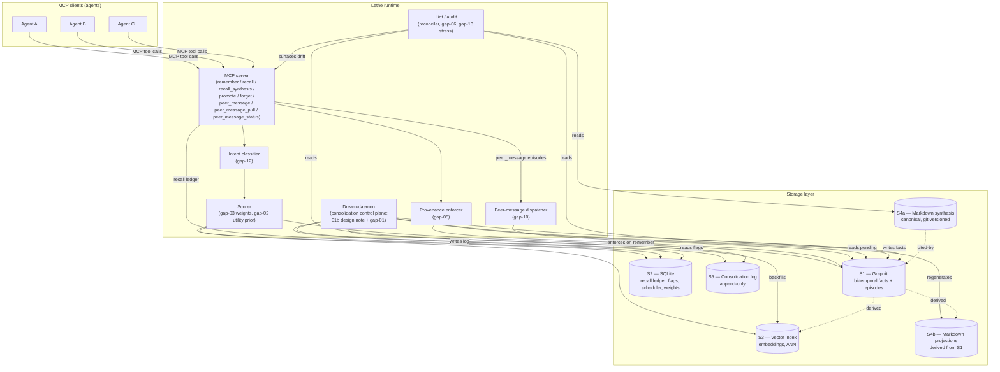

# 03 — Composition Design (WS3 Track A)

**Status:** WS3 Track A deliverable. Recommendation; not a binding implementation spec.
**Audience:** the WS6 (API) and WS7 (migration) authors who will lean on this most. Also WS5 (scoring) and WS4 (eval), to know which store their signals come from.
**Inputs:** `PLAN.md` §"real research thrust" question A; `docs/00-charter.md` §3 (positioning); `docs/02-synthesis.md` §1 (what the field knows), §2.8 (markdown-vs-graph authority), §5 (substrate commitments); `docs/01b-dream-daemon-design-note.md` §3 (per-module mapping); lit-review briefs 01 (Zep), 02 (MAGMA), 04 (Memory-as-Metabolism), 12 (Graphiti), 14 (Graphiti issue #1300), 15 (Letta), 17 (qmd), 21 (Karpathy).
**Out of scope:** API verb signatures (WS6), scoring math (WS5), eval harness (WS4), migration phasing (WS7). Pointers, not specifications.

---

## 1. Frame

PLAN.md poses the composition question as: *how do markdown, SQLite metadata, vector embeddings, temporal/graph indices, and a consolidation loop compose into one coherent runtime?* Not one paper or reference impl in the WS2 set has answered it cleanly — each optimizes one component (Graphiti optimizes the graph; Letta optimizes core/archival memory; qmd optimizes on-device hybrid retrieval; Cognitive Weave optimizes the scoring math; Karpathy's wiki optimizes human-legibility). Lethe's distinctive contribution is the **integration**, and integration begins with five questions:

1. **Ownership.** For every fact in the system, *which store is the source of truth?*
2. **Read paths.** Per MCP verb, *which stores are consulted in what order?*
3. **Write paths.** Per MCP verb, *which stores are written to synchronously, which asynchronously?*
4. **Consistency.** Where is ACID required? Where is eventual consistency acceptable? What survives a crash?
5. **Failure modes.** When any one store is down, stale, or corrupted, *what still works?*

This document answers all five for the recommended topology, evaluates two alternatives, and hands every unresolved seam to a named gap brief in `docs/03-gaps/`.

The substrate choice is settled (HANDOFF.md §2.3): Graphiti, Apache-2.0, bi-temporal, MCP-exposed. The surface is settled: MCP. The write-path shape is settled: fast synchronous + async consolidation. What remains is the **layering** — which derived stores live where, and what the contracts between them are.

---

### 1.1 Markdown audience and the real constraint

Markdown in Lethe is a dual-audience surface: humans read and edit it; LLM agents read it via `recall_synthesis` (§3.2). The historical "markdown is for humans" framing in earlier drafts was a category error — LLMs parse markdown natively and that is precisely why markdown is the right substrate for synthesis pages. The real design constraints are:

1. **Canonicality.** S1 is the source of truth for facts. S4b (fact projections) exists for filesystem-inspection convenience; the API does not read S4b back, because doing so would either duplicate S1 (bloat) or surface stale views (correctness).
2. **Context bloat.** Even though agents *can* read every markdown file, surfacing all of them on every recall would blow the context budget. `recall_synthesis` is the gated entry-point that limits exposure to relevant S4a pages.
3. **Authored vs derived separation.** S4a (authored synthesis) is canonical at the markdown layer; S4b (derived projections) is canonical at the graph layer. The dividing line is *who wrote it*, not *who reads it*.

Subsequent sections refer to "the API does not read S4b" — this is shorthand for canonicality + bloat-avoidance, not a statement about LLM capability.

---

## 2. Named stores — ownership matrix

Five stores. Each has one and only one canonical responsibility. Where two stores hold "the same" data, exactly one is authoritative and the other is derived.

| # | Store | Backing tech (recommended) | Owns (canonical) | Derives from | Does NOT own |
|---|---|---|---|---|---|
| **S1** | **Temporal/graph index** | Graphiti (Neo4j or FalkorDB backend) | Bi-temporal facts: typed entity nodes, typed edges with `(valid_from, valid_to, recorded_at)`, episodes (raw observation payloads), provenance edges from fact → episode. **Source of truth for everything `recall` returns.** | — (canonical) | Embeddings; LLM-extraction confidence scores (lives in S2); ranking weights (lives in S2); markdown rendering. |
| **S2** | **SQLite metadata** | Single SQLite file per tenant, WAL mode | Recall ledger (every `recall` returns a `recall_id`; ledger logs query, returned-fact-ids, timestamp); utility-feedback events (citations, downstream tool-call outcomes, explicit corrections); promotion/demotion flags; consolidation scheduler state (gates, locks, run history); extraction-confidence log; tenant config + scoring-weight overrides. | Episodes in S1 (foreign-key by episode-id); recall events from runtime. | Facts themselves (those live in S1); embeddings (S3); markdown text (S4). |
| **S3** | **Vector index** | sqlite-vec or pgvector (single-tenant); shared index allowed across tenants if RBAC enforced | Embeddings keyed by `(node_id, edge_id, episode_id)`; ANN lookup. | S1 fact text + S1 episode text. **Stale-tolerant; rebuildable.** | Canonical text (lives in S1 as node/edge attributes or in S1 episodes). The vector index never holds the only copy of anything. |
| **S4** | **Markdown surface** | Filesystem under tenant storage root | Two distinct sub-domains (see §2.1): (a) **synthesis pages** — authored knowledge pages, design notes, wikis (canonical here); (b) **fact projections** — `MEMORY.md`-style human-readable dumps (derived from S1). | S1 (for projections); human authorship (for synthesis pages). | Bi-temporal facts; provenance graph; recall ledger. |
| **S5** | **Consolidation log** | Append-only file or table (recommend SQLite table in S2 with retention policy, or `log.md` per dream-daemon precedent) | Every dream-daemon decision: promotions, demotions, merges, invalidations, peer-message deliveries, with rationale + input fact-ids + output fact-ids. **Owns the answer to "why is the graph in this state right now?"** | Dream-daemon runtime decisions. | Decisions of the substrate itself (Graphiti's bi-temporal stamps live in S1). |

### 2.1 The dual domain inside S4 (markdown surface)

The markdown surface is split because charter §3 commits to markdown as the human-readable surface, but synthesis §2.8 documents a real tension: Graphiti-style systems treat markdown as a *projection*, while Karpathy's wiki and qmd treat markdown as the *source*. Resolving this in one direction or the other for *all* markdown content overfits one use case at the cost of the other.

The split:

- **S4a — synthesis pages (markdown-canonical).** Authored knowledge pages: design notes, "what I learned about X" wikis, project documentation. Humans (or LLMs acting on human-authored prompts) write these. They are not auto-derived. Lethe **does not** invalidate or rewrite them on consolidation. Storage is git-friendly markdown with YAML frontmatter for metadata. The graph-index references them by stable URI and may *cite* them in retrieval, but cannot rewrite them.
- **S4b — fact projections (graph-derived).** `MEMORY.md`-class human-readable dumps of currently-valid facts. These are regenerated on consolidation cycles from S1; user edits to them are advisory hints to the consolidator, not authoritative changes. SCNS's `MEMORY.md` lives here today; Lethe v1 keeps generating it.

The dividing line is not "is this markdown?" but **"is this a factual claim or an authored synthesis?"** Factual claims (entities, relationships, observations, preferences-as-data) live in S1; their markdown rendering is S4b. Synthesis (interpretation, design intent, narrative) lives in S4a; it has no graph rendering.

This split is the resolution to topology choice §6 (hybrid layered).

---

## 3. Read paths

Read paths per MCP verb. Order matters: it determines the failure-mode degradation profile (§7).

### 3.1 `recall(query, intent?, scope?)`

The hot path. Latency budget aimed at p95 ≤ ~250 ms (refined in WS4) **under heuristic-only intent classification; LLM-residual recall p95 measured separately** (cross-link: `gap-12 §7` "LLM latency budget" residual unknown).

```
recall →
  1. intent-classify (gap-12)               [synchronous LLM or rule-based; falls back to "what" intent]
  2. weight-tuple-select (gap-03)           [reads tenant scoring config from S2]
  3. parallel: {
        graph-walk on S1                     [Graphiti hybrid: BM25 + graph-distance]
        vector ANN on S3                     [embedding lookup, top-K]
        lexical-only on S1 episode text      [BM25 fallback path; survives S3 outage]
     }
  4. union → rerank by weight tuple          [S1 attributes + S3 distance + S2 utility-prior]
  5. enforce provenance (gap-05)             [drop any candidate fact without an episode-id pointer]
  6. write recall_id to S2 ledger            [synchronous; this is the utility-feedback hook]
  7. prepend always-load preferences (§3.5)   [implicit; capped per gap-09 §6 always-load bandwidth]
  8. return (facts, recall_id, provenance, preferences) →
```

Which stores get touched: **S1 always, S3 usually, S2 always, S4/S5 never.** The recall path does not depend on S4 (markdown) or S5 (consolidation log). S4 is not on the recall fact-path because S1 is canonical (reading S4b would be redundant + stale; S4a has its own dedicated path via `recall_synthesis`, §3.2). Consolidation log is for audits.

### 3.2 `recall_synthesis(uri | query)` (S4a-targeted)

Distinct path because synthesis pages are S4a-canonical. Implementation: qmd-style hybrid retrieval over the markdown corpus (BM25 + vector + LLM rerank — brief 17). Returns markdown text + frontmatter, never claims to return "facts." This path exists to keep the human-legible surface useful without polluting the fact-recall path.

### 3.3 `peer_message_inbox(recipient_scope)`

Reads from S1 with a `from_peer=true & recipient_scope=<self>` filter. Detail in gap-10.

### 3.4 Lint / audit reads

Audit queries ("show me every fact derived from episode-id X") read S1 (provenance edges) joined with S5 (consolidation history). These are slow-path; no latency budget; intended for humans and CI lint hooks.

### 3.5 Tenant-init bootstrap (always-load preference path)

Per `gap-09 §3`, S4a synthesis pages tagged `kind=preference` are **always-load**: the runtime treats them as MemGPT-style "core memory" that must be visible to the agent on every turn, not a recall-on-demand resource. The composition mechanism is an **implicit prepend on every `recall` response** rather than a separate verb or a session-start preload:

1. On `recall`, after step 6 (ledger write), the runtime fetches the tenant's `kind=preference` pages from S4a (qmd-class index over the markdown corpus, scoped by tenant).
2. Their text is concatenated and prepended to the response payload under a `preferences[]` field, distinct from `facts[]` so callers cannot confuse a preference with a returned fact.
3. The total preference payload is capped per `gap-09 §6` "always-load bandwidth" (target ≤ 10 KB per tenant); over-cap pages truncate by recency-of-revision and surface a `preferences_truncated=true` flag.
4. Stores touched: **S4a always, S2 once** (a counter for cap-overflow telemetry); no S1 fetch on this path. Latency is bounded by the qmd-class index, not the graph walk.

This path is **on every `recall`**, not a one-shot tenant-init step — "tenant-init" is a misnomer kept for naming continuity with MemGPT's "core memory always loaded." A first-class `recall_synthesis(kind=preference)` call works too, but agents should not need it; the prepend makes preferences ambient.

WS6 owns the wire format of `preferences[]`; this section commits the mechanism.

---

## 4. Write paths

The write-path commitment (synthesis §1.3) is **fast synchronous + async consolidation**. The synchronous portion does the minimum to make the data durable and queryable; the async portion does the expensive extraction, scoring, merging.

### 4.1 `remember(payload, provenance)` — the canonical write

```
remember(payload, provenance) →
  SYNCHRONOUS  (transaction T1, ACID):
    1. validate provenance (gap-05)              [refuse if missing]
    2. write episode to S1                        [Graphiti episode insert]
    3. write episode-arrival event to S2 ledger   [for dream-daemon scheduling]
  → return episode_id, ack

  ASYNCHRONOUS  (dream-daemon or eager-extract worker):
    4. LLM-extract entities + edges from episode  [extraction-confidence → S2 log; gap-06]
    5. merge into S1 (bi-temporal stamping)       [gap-13 contradiction handling]
    6. embed new nodes/edges into S3              [vector backfill]
    7. append CONSOLIDATE entry to S5             [audit trail]
    8. (optional) regenerate S4b projection       [throttled; gap-07 write-amp budget]
```

T1 (lines 1–3) is one ACID transaction across S1 and S2. If T1 fails, nothing was written and the caller can retry. If T1 commits, the episode is durable; everything after line 3 is recoverable on dream-daemon restart from the episode-arrival event in S2.

### 4.2 `promote(fact_id, reason?)` and `forget(fact_id, mode, reason)`

```
promote / forget →
  SYNCHRONOUS  (transaction T2):
    1. validate fact exists in S1
    2. write promotion-flag / forget-flag to S2   [does NOT modify S1 immediately]
    3. write event to S5 (rationale + caller)
  → return ack

  ASYNCHRONOUS  (next consolidation cycle):
    4. dream-daemon reads S2 flags
    5. for each flag, apply policy:
         - promote → adjust S1 priority/decay attributes (gap-01)
         - forget(invalidate) → set valid_to in S1 (bi-temporal; gap-13 + gap-11)
         - forget(quarantine) → write S1 quarantine flag (excluded from recall) (gap-11)
         - forget(purge) → hard-delete from S1 + S3, log retention proof in S5 (gap-11)
    6. clear flag in S2; append outcome to S5
```

The synchronous portion never modifies S1 facts — it only records intent. This is deliberate: it makes promote/forget cheap on the hot path and lets the dream-daemon batch them with the scoring pass. The flag in S2 is the durable record that the user *asked* for the change; if the dream-daemon crashes between flag-write and apply, the next run picks it up.

### 4.3 `peer_message(payload, recipient_scope, sender_provenance)`

Treated as a `remember` variant (gap-10): synchronous write of a typed episode into S1 with `from_peer=true` and `recipient_scope=<scope>`. Recipients pull via `recall` filter; Lethe never push-injects into another agent's context.

### 4.4 `consolidate()` — the dream-daemon's main loop

Async only. Triggered by gates (time + episode-count + lock free, per dream-daemon design note §2.3). One loop:

1. Acquire tenant lock in S2.
2. Read pending episodes from S1, pending flags from S2.
3. Extract → merge → score → demote/promote → invalidate → embed-new-nodes → regenerate-projections.
4. Write each phase outcome to S5.
5. Release lock.

The dream-daemon design note (§2.3, §2.10) covers cadence, gate logic, and stale-lock recovery; gap-01 evaluates the design's fitness as Lethe's v1 spine and names break-points.

---

## 5. Consistency model — explicit per store

The user prompt was specific: *do NOT punt on consistency; explicitly say where ACID is required and where it isn't, with rationale per store.* This is that section.

| Boundary | Stores | Required guarantee | Why this is sufficient | Crash recovery |
|---|---|---|---|---|
| **`remember` synchronous portion** | S1 + S2 | **ACID across S1 + S2** in transaction T1: (episode insert in S1) ∧ (arrival event in S2). Two-phase commit if S1 and S2 are physically separate; single-DB transaction if S2 is the Graphiti-backing DB. | The episode is the unit of provenance. Losing an episode after the caller got an ack would break the provenance invariant gap-05 commits to. The arrival event in S2 is the dream-daemon's wake-signal — losing it means the episode never gets extracted. Both must commit or both must roll back. | If T1 aborts, caller retries (idempotent on a client-supplied UUID). If process crashes after T1 commit but before extraction, dream-daemon picks up unextracted episodes from S2 ledger on next gate. |
| **`promote` / `forget` synchronous portion** | S2 + S5 | **ACID across S2 + S5** in transaction T2. S5 is recommended to live as a SQLite table inside S2, in which case T2 is a single-DB transaction. | The flag in S2 + the audit entry in S5 must both succeed or both fail; otherwise we can apply a forget that has no audit trail (gap-11 violation) or audit a forget that never applies (gap-13 inconsistency). | Same model as T1: idempotent retry; dream-daemon catches up on next gate. |
| **`recall` ledger write** | S2 | Atomic single-row insert. Crash before insert = lost utility-feedback signal for that recall (acceptable; signal is statistical, not authoritative). | The recall_id is returned to the caller; if the insert failed, caller's later utility-callback will reference an unknown id, which is logged-and-dropped, not propagated. | No recovery needed; signal loss is bounded by uncommitted-since-last-checkpoint window. |
| **Vector index (S3)** | S3 | **Eventual consistency w.r.t. S1.** S3 is rebuildable in O(\|nodes\| + \|edges\|) embedding calls. | S3 is a performance accelerator, not a source of truth. A divergence between S1 and S3 produces degraded recall, never wrong recall (because the rerank step re-reads S1 attributes). The lexical-only fallback path (§3.1 step 3) keeps `recall` working even with S3 fully unavailable. | On detection of divergence (e.g., S3 returns a node-id not in S1), drop and re-embed. Periodic full-rebuild job (cheap to schedule weekly). |
| **Markdown projections (S4b)** | S4b | **Eventual consistency w.r.t. S1.** Lossy (we don't put every fact into the markdown view). Regenerable from scratch. | S4b exists as a redundant projection of S1 (canonical); the API never reads S4b back to avoid bloat and staleness. Humans (and agents using filesystem inspection outside the API) can read it as a convenience surface. Staleness on the order of a consolidation cycle (default ~24 h) is acceptable because no consumer treats S4b as authoritative. | Regenerate from S1 + the most-recent S5 snapshot. No data loss possible because S4b never holds canonical content. |
| **Synthesis pages (S4a)** | S4a | **Strong consistency only at the file-system level** (atomic file-replace or git). Not coordinated with S1; the graph **cites** S4a, never rewrites it. | Synthesis pages are authored, not derived. Coordinating them with S1 would require Lethe to understand authorial intent, which it can't. The price is that a synthesis page can disagree with the graph. The lint hook (§3.4) surfaces these disagreements; resolution is human. | File-system atomic-rename pattern; no Lethe-level recovery. |
| **Consolidation log (S5)** | S5 | **Append-only, write-once.** Crash mid-append loses at most the current entry (which describes a not-yet-committed consolidation step that itself is rolled back). | The log is the audit trail. Append-only is sufficient because we never need to update an entry; we may add a "supersedes" entry pointing back. | If a S5 append fails after the corresponding S1 update committed, an external reconciler (`scripts/lethe-audit lint --reconcile`) detects the missing log entry and writes a backfill entry tagged `provenance=reconciler`. |

### 5.1 The non-ACID assumption we're betting on

We are explicitly **not** providing ACID across the whole system. Specifically:

- **S1 ↔ S3 inconsistency is allowed.** Reasoning: S3 is regenerable; the rerank reads S1 attributes; the lexical-fallback path keeps recall working. Cost of forcing ACID here = synchronous embedding on `remember` = blows the latency budget.
- **S1 ↔ S4b inconsistency is allowed.** Reasoning: S4b is regenerable on the consolidation cycle. Cost of forcing ACID here = write amplification (gap-07) on every fact change. PLAN.md preamble warns directly about this.
- **S1 ↔ S4a inconsistency is allowed by design.** S4a is authored; it can disagree with the graph until a human reconciles. Lint hook surfaces it; no automatic correction.

The places where we **do** require ACID (T1: episode + ledger; T2: flag + log) are exactly the spots where losing one side without the other breaks an invariant another component will silently rely on. Everywhere else, eventual consistency + a reconciler is cheaper and good enough.

### 5.2 Multi-tenant + multi-agent isolation

Tenant scope is a top-level partition on every store: Graphiti `group_id` (S1, brief 12); per-tenant SQLite file (S2/S5); per-tenant subdirectory in S3 (or RBAC-tagged shared index); per-tenant root path in S4. **No cross-tenant reads, ever.** Multi-agent within one tenant share S1; gap-04 covers concurrency.

---

## 6. Provenance propagation

Provenance is a **type-system invariant** (charter §4.1; gap-05). Every fact ever returned by `recall` traces to an episode; every episode traces to a `remember` call with a caller-supplied source.

The chain:

```
caller-supplied source
  ↓ (mandatory in remember; refused if missing)
S1 episode (raw payload + source URI + caller agent id)
  ↓ (extraction step writes provenance edge: fact → episode)
S1 fact-edge / fact-node (carries episode-id pointer)
  ↓ (recall reranks but never strips provenance)
returned fact: {fact, provenance: {episode_id, source_uri, agent_id, recorded_at}}
  ↓ (caller may follow provenance.episode_id to fetch raw episode)
audit / dispute / re-extraction
```

Promotion and forgetting **preserve** provenance: a promoted fact still points to its source episode; a `forget(invalidate)` sets `valid_to` but the fact and its provenance edge remain queryable in audit mode. Only `forget(purge)` removes provenance — and it logs a retention-proof entry in S5 to demonstrate the legal-class operation happened (gap-11).

Peer messages get a *layered* provenance: the message episode carries `(from=peer_agent, source_uri=peer_message)`; the peer's original episode (referenced by id) is preserved as a citation. The recipient cannot launder peer-asserted facts as their own. Detail in gap-10.

---

## 7. Failure-mode analysis

Per the user's emphasis: WS6 (API) and WS7 (migration) lean on this most. The principle behind the analysis: **degrade, don't fail.** Each store has a defined down/stale/corrupted mode, and `recall` and `remember` have explicit fallback behavior for each.

| Failure | Detection | Effect on `remember` | Effect on `recall` | Mitigation |
|---|---|---|---|---|
| **S1 (Graphiti) down** | Episode insert returns connection error or transaction timeout. | **Hard fail.** S1 is canonical; without it we cannot durably record the episode. `remember` returns 5xx with a retry-after hint. The MCP client's expectation is that `remember` may fail; this is the documented failure case. | **Hard fail on the fact path.** `recall_synthesis` (S4a, qmd-style) **still works** since it doesn't touch S1. The runtime should split error codes so clients can fall back to synthesis-only retrieval if appropriate. | (a) Graphiti deployment with backing-DB high-availability (Neo4j cluster or FalkorDB replica). (b) `remember` queue: if the runtime can buffer episodes locally (small bounded write-ahead log on the Lethe host) and replay when S1 returns, this converts a hard fail into a delayed durable. v1 likely ships **without** the queue and accepts the hard-fail; v2 candidate. |
| **S2 (SQLite) down or locked** | WAL contention, `SQLITE_BUSY`, file unavailable. | **Soft fail.** T1 cannot commit (episode-arrival event needs S2). Caller-visible: same as S1 down. In practice S2 is a local SQLite file co-located with the runtime, so this only happens on disk-full, permission, or corruption. | **Degraded.** Recall ledger writes fail (we lose utility-feedback for queries during the outage). Scoring weights fall back to baked-in defaults (the per-tenant overrides live in S2). Recall otherwise works. | (a) SQLite on a healthy disk with `journal_mode=WAL`, `synchronous=NORMAL`. (b) Liveness check on Lethe startup that fails fast if S2 isn't writable — better than silent ledger loss. |
| **S3 (vector index) stale** | Vector returns ids that don't exist in S1, or ANN recall@10 against a known seed query drops below threshold. | **No effect.** `remember` does not block on S3 (embedding is async, line 6 of §4.1). | **Degraded recall quality, never wrong.** Rerank still pulls fresh attributes from S1; lexical-only fallback path catches anything S3 misses. | (a) Periodic incremental embed job. (b) Full rebuild script `scripts/embed/rebuild.sh` (referenced from WS7). (c) WS4 includes "lethe with S3 disabled" as a recall-quality data point. |
| **S3 (vector index) fully unavailable** | Connection error to embedding service or vec extension. | **No effect** (async path; embedding worker queues retries). | **Degraded.** Recall flow §3.1 step 3 collapses to graph-walk + lexical only. WS4 measures the precision/recall delta. Fallback is documented; not a hard fail. | Same as stale, plus a runtime config flag to disable S3 entirely for testing/eval. |
| **S4a (synthesis pages) corrupted** (e.g., a bad git pull, accidental rm, file-system damage) | qmd-class indexer fails to parse a page; checksum mismatch. | **No effect.** S4a is not on the `remember` path. | `recall_synthesis` returns degraded results (missing pages). `recall` (fact path) is unaffected because S4a is not consulted. | (a) Git-versioned S4a is the strong recommendation; rollback is a `git reset`. (b) Lint hook detects unparseable pages and quarantines them. |
| **S4b (markdown projections) diverged** from S1 | Reconciler diff: a fact in S4b is no longer valid in S1, or vice versa. | **No effect.** S4b is not on the `remember` path. | **No effect on `recall`.** The API never reads S4b back (S1 is canonical; S4b is a redundant projection). Humans or external tools reading the markdown directly may see stale data; the agent reading via `recall` does not, because `recall` reads S1. | Throttled regeneration (gap-07 write-amp budget). The point of the layered topology is that S4b **is allowed** to diverge for up to one consolidation cycle. |
| **S4b regeneration loop crashes mid-write** | Partial file written; reconciler detects truncation. | **No effect.** | Same as "S4b diverged." | Atomic-rename pattern: write to `MEMORY.md.tmp`, fsync, rename. Crash leaves either old or new file, never partial. |
| **S5 (consolidation log) append fails** after S1 update committed | Reconciler sees S1 transition with no S5 entry. | n/a. | n/a. | Reconciler writes a backfill entry tagged `provenance=reconciler, evidence=s1_state_diff`. The audit trail is degraded (we know *that* the change happened; not the original rationale) but not lost. WS4 reports S5-coverage% as a system-health metric. |
| **A peer-message corrupts a memory** (peer agent asserts a false fact, or worse, contradicts a known-good fact) | Either downstream contradiction-detection fires (gap-13) or a human / lint hook surfaces the disagreement. | n/a; the corruption already happened on a prior `remember`. | The peer's assertion is in S1 with `from_peer=peer_agent` and provenance pointing at the peer-message episode. **It does not overwrite the recipient's own facts** (gap-10 isolation). On contradiction the bi-temporal invalidate (gap-13) marks one side `valid_to=now`; provenance survives so the audit trail shows which side won. | (a) Provenance enforcement (gap-05) so peer-asserted facts are always distinguishable from self-observed. (b) Trust-weighting in scoring (gap-03) so peer-asserted facts can be down-weighted by default. (c) `forget(quarantine)` for poisoned peer episodes — invalidate the *episode*, not just the derived fact, and the next consolidation re-derives without it. |
| **Dream-daemon stuck or crash-looping** | Lock held > 5× gate interval (dream-daemon design note §2.3); failure backoff exhausted. | **No effect.** `remember` only touches T1; consolidation is downstream. | **Degraded.** New episodes accumulate but aren't extracted; recall over recent material loses recall but not precision. | Stale-lock break (already in dream-daemon §2.2 / §2.3); failure backoff (gap-01 names this as a break-point of the current dream-daemon — exponential backoff is a Lethe-side fix). Ops alarm on `time-since-last-successful-consolidation > 2 × gate_interval`. |
| **Tenant isolation breach** (a query somehow returns another tenant's facts) | Should be impossible by construction (group_id filter on every Graphiti call); detected by lint hook in test. | n/a. | **Hard fail of the security model.** Treat as a P0 bug. | Defensive: every Lethe storage call goes through a single `tenant_scope_filter` middleware; integration test asserts cross-tenant reads return zero. WS6 owns this gate; WS7 migration has a tenancy soak-test as a phase gate. |
| **Schema migration mid-flight** (Lethe upgrade adds a new edge type or fact attribute) | n/a (operator-driven). | Blocked during migration window. | Blocked during migration window. | Migration-window pattern: drain dream-daemon, take consolidation lock, run migration, release. Documented in WS7. |
| **Disk full** | OS-level write error on S2/S3/S4. | T1 fails (S2 write); `remember` returns 5xx. | Degraded as per S2/S3 stale rows above. | Lethe runtime monitors disk free; refuses new `remember`s below a configurable threshold rather than silently corrupting. |
| **Clock skew across runtime instances** (multi-process Lethe) | Bi-temporal stamps from instance A appear "in the future" to instance B. | Subtle: a `valid_to` from one instance can be earlier than another instance's `recorded_at`. | Subtle: invalidation race. | Single-tenant single-writer assumption for v1 (one Lethe runtime per tenant). Multi-writer is a v2 problem, called out in gap-04. |

### 7.1 The "two stores down" matrix

What if more than one store is down at the same time? Three combinations matter:

- **S1 + S3 down:** `recall` is dead (no fact path; no vector path). `recall_synthesis` (S4a) survives. `remember` is dead. This is "Lethe is down." Documented.
- **S2 + S5 down (they share storage):** No utility-feedback capture, no consolidation scheduling, no audit trail. Recall and remember technically work but the loop is open. Treated as "Lethe is in degraded read-only mode" — disable `remember` defensively until S2 returns to avoid silently ungraded write traffic.
- **S1 + S4 down:** `recall` works (degraded; no synthesis); `remember` is dead. This is partial; declare partial-availability in the health endpoint.

These edge cases are noted here; WS6's health-endpoint design must surface them as named states.

---

## 8. Candidate topologies — evaluation

The user prompt requires evaluating multiple candidates and recommending one. Three named candidates; trade-off table; recommendation.

### 8.1 Candidate A — Markdown-primary with metadata sidecars

**Shape.** S4 is canonical for everything. Markdown frontmatter holds bi-temporal stamps. S1 is a derived index regenerated from S4 on consolidation. S3 derives from S4. S2 holds only ephemeral runtime state (recall ledger). The reference is Karpathy (brief 21) extended with stronger frontmatter discipline.

**Strengths.**
- Human-legible by construction. Every fact is visible in a markdown file.
- Git-versionable; rollback is `git reset`.
- Operationally simple: no graph DB to run.

**Weaknesses.**
- **Write amplification at agent-loop scale** (PLAN.md preamble §"From the Karpathy gist"; brief 21 explicit-limits table). Karpathy explicitly says ~100 sources / ~hundreds of pages, and "a single source might touch 10–15 wiki pages." At swarm-write rates this is untenable.
- **No native bi-temporal primitive.** Frontmatter `valid_to` is a string we agreed on; it has no enforcement. Synthesis §1.2 commits to bi-temporal invalidation; doing it in markdown means re-implementing the substrate Graphiti already gives us for free.
- **No multi-agent merge story.** Concurrent writes to the same markdown file = file-level conflict, not fact-level merge. CRDT-on-markdown is research, not a v1.
- **Provenance is convention, not enforcement.** Karpathy's frontmatter is unenforced; the synthesis §2.5 "supported but not enforced" critique applies in full.

**Verdict.** Optimizes the human-legibility axis at the price of every other Lethe commitment. The PLAN.md preamble's enumeration of Karpathy gaps is essentially a list of why this topology fails for Lethe v1.

### 8.2 Candidate B — Graph-primary with markdown projections

**Shape.** S1 is canonical for everything. S4 is entirely a projection of S1. Synthesis pages, if they exist, are nodes-with-text-attributes inside the graph. The reference is Graphiti + brief 15 (Letta) productionized.

**Strengths.**
- Bi-temporal primitive is native (synthesis §1.2; brief 12).
- Multi-agent merge happens at the graph layer (group_id; gap-04 details). Concurrency is not a markdown problem.
- ACID where it matters (S1 transactions); eventual everywhere else.
- Letta has shipped a productionized variant; the engineering risk is bounded.

**Weaknesses.**
- **Synthesis pages become unnatural.** Authored content (design notes, "what I learned") flattened into graph nodes loses the affordance of a markdown file you can edit, diff, git-blame. Charter §3 commits to "markdown remains the human-readable surface for trackpad and synthesized knowledge pages" — Candidate B preserves trackpad but degrades synthesis.
- **Graph-rendered synthesis is mediocre.** Generating prose from a graph traversal is a known-hard problem; the alternative (storing prose as a node attribute) is just markdown-in-a-database with worse tooling.
- **Operational footprint.** Graphiti requires a graph backend (Neo4j or FalkorDB). For users who only want SCNS-class personal-scale memory, that's a heavy default. (Mitigatable: SQLite-backed Graphiti variants exist or can be built; gap-07 touches this.)

**Verdict.** Wins on every fact-storage axis; loses on the authored-synthesis axis. Charter §3 makes the latter non-negotiable.

### 8.3 Candidate C — Hybrid layered (graph-primary for facts, markdown-primary for authored synthesis)

**Shape.** The five-store design described in §2. **S1 canonical for facts**; **S4a canonical for authored synthesis**; **S4b derived from S1**; S2/S3/S5 in their roles described above.

**Strengths.**
- Wins facts on the graph layer (Candidate B's strengths).
- Wins synthesis on the markdown layer (Candidate A's surface affordance).
- The dividing line — *factual claim vs. authored synthesis* — is naturally the line developers already draw between "data the agent observed" and "documentation a human wrote." It does not invent a new ontology.
- Aligns with synthesis §1.1 ("typed-entity nodes + typed-edge relationships + a temporal index" for facts) and §2.8 (the markdown-vs-graph tension is real and must be split, not chosen).

**Weaknesses.**
- **Two source-of-truth domains** require a clear, enforced dividing line. If a developer puts a factual claim in a synthesis page expecting it to be queryable, they'll be surprised. Mitigation: lint hook surfaces "fact-shaped sentences in synthesis pages" as a warning; gap-06 touches this.
- **Ingest-from-synthesis is a complication.** When a synthesis page asserts something the graph should know, do we extract it? v1 answer: no, by default. A synthesis page can opt-in to ingest-extraction by a frontmatter flag (`lethe.extract: true`); without the flag, synthesis is **not extracted into S1 facts** — to avoid canonical-fact drift from authored prose. Synthesis is still readable by agents via `recall_synthesis` (§3.2); the flag controls *ingest*, not *readability*.
- **More moving parts** than B alone (the qmd-style retrieval path for S4a is a second retriever to maintain).

**Verdict — recommended.** Justification:

1. Charter §3 commits to *markdown for synthesized knowledge pages*. Candidate B violates this. Candidate A meets it but breaks every other commitment. Only C threads the needle.
2. Synthesis §2.8 named this tension explicitly and called it open. Resolving it as "the line is factual-claim vs. authored-synthesis" is the cleanest answer the WS2 substrate supports.
3. The cost — a second retriever for S4a — is bounded: brief 17 (qmd) is an existing reference impl that already does on-device markdown retrieval; we adopt its pattern, not write our own.

### 8.4 Trade-off table

| Axis | A (md-primary) | B (graph-primary) | C (hybrid layered) |
|---|---|---|---|
| Human-legibility (charter §3) | ✅✅ | ❌ | ✅ |
| Bi-temporal primitive | ❌ (re-implement) | ✅ (Graphiti) | ✅ (S1) |
| Multi-agent merge | ❌ | ✅ | ✅ |
| Provenance enforcement | ❌ (convention) | ✅ (type) | ✅ (type, on facts) |
| Write-amp at swarm scale | ❌❌ (Karpathy ceiling) | ✅ | ✅ (S4b throttled) |
| Authored-synthesis affordance | ✅✅ | ❌ | ✅✅ (S4a) |
| Operational simplicity | ✅✅ | ❌ | ❌ (more moving parts) |
| Aligns with substrate decision | ❌ | ✅ | ✅ |
| ACID on the canonical write | ❌ (file system) | ✅ (S1) | ✅ (S1+S2 T1) |
| Eval substrate ready (briefs 18–20 directly applicable) | partial | ✅ | ✅ |

**Recommendation: Candidate C — hybrid layered.** Drawing the dividing line at *factual claim vs. authored synthesis*, with S1 (Graphiti) canonical for facts and S4a (markdown) canonical for synthesis, is the topology that satisfies charter §3 *and* synthesis §1.1 *and* the bi-temporal commitment from §1.2 simultaneously. It is also the only topology where the WS2-substrate failure modes (graph DB crash, vector staleness, markdown corruption) all have already-validated mitigations.

---

## 9. Component diagram



---

## 10. Open seams handed to gap briefs

Every unresolved decision in this document is delegated to a named gap brief. The composition design commits to *positions* on store ownership, R/W paths, and consistency, but does **not** answer:

| Open seam | Handed to |
|---|---|
| Dream-daemon fitness as v1 spine; promotion/demotion thresholds; failure-backoff | **gap-01** (retention engine) |
| Utility-feedback signal definition + ingestion pipeline from S2 ledger into scoring | **gap-02** (utility-feedback loop) |
| Default scoring weights (the recall §3.1 step 4 weight tuple); tuning protocol | **gap-03** (scoring weights + tuning) |
| Concurrent writes to S1 from multiple agents within one tenant (group-id-scoped) | **gap-04** (multi-agent concurrency) |
| Type-system enforcement of provenance; rejection rules in the synchronous remember path | **gap-05** (provenance enforcement) |
| Extraction-confidence logging into S2; dispute path; re-extraction trigger | **gap-06** (extraction quality) |
| S4b regeneration policy (full vs. incremental vs. on-read); write-amp budget; retrieval ceiling past Karpathy's 100-source limit; concurrency on S4a | **gap-07** (markdown scale) |
| T1 / T2 transaction implementation; resumable consolidation; dream-daemon lock recovery details | **gap-08** (crash safety + durability) |
| Whether non-factual memory (goals, values, preferences-as-data) goes in S1 or a parallel store | **gap-09** (non-factual memory) |
| `peer_message` semantics; recipient_scope; trust weighting; quarantine of poisoned peer episodes | **gap-10** (peer messaging) |
| `forget(invalidate / quarantine / purge)` semantics; minority-hypothesis retention; safety framing | **gap-11** (forgetting-as-safety) |
| Intent taxonomy; classifier mechanism; routing weights; misclassification fallback | **gap-12** (intent classifier) |
| Stress-test of bi-temporal invalidate at high contradiction density; break-points; v2 directions | **gap-13** (contradiction resolution) |
| How WS4 builds an eval set on top of this topology without confirmation bias | **gap-14** (eval-set bias) |

These pointers are bidirectional: each gap brief should cite this document for the topology it operates inside, and this document should be read with those briefs as appendices. The composition design is the floor plan; the gap briefs are the rooms.

---

## 11. What this design does *not* commit to (deferred to downstream WS)

- **API verb signatures.** §3–§4 use named verbs; the parameter shapes, error codes, idempotency keys, and MCP schema are WS6.
- **Scoring formulas.** §3.1 step 4 uses "weight tuple" as a placeholder; the math is WS5 + gap-03.
- **Eval set construction.** §7 names WS4 as the consumer of the failure-mode metrics; the harness is WS4.
- **Migration phasing.** §7's "lethe with S3 disabled" eval mode is a WS7 input; the SCNS → Lethe phasing itself is WS7.
- **Cost / latency budgets.** Numbers in §3.1 (~250 ms p95) are illustrative; WS4 measures, WS6 commits.
- **Specific Graphiti deployment topology** (Neo4j vs. FalkorDB vs. SQLite-backed). gap-07 + WS7.

---

## 12. Change log

- **2026-05-01** — initial WS3 Track A deliverable. Recommends Candidate C (hybrid layered).
